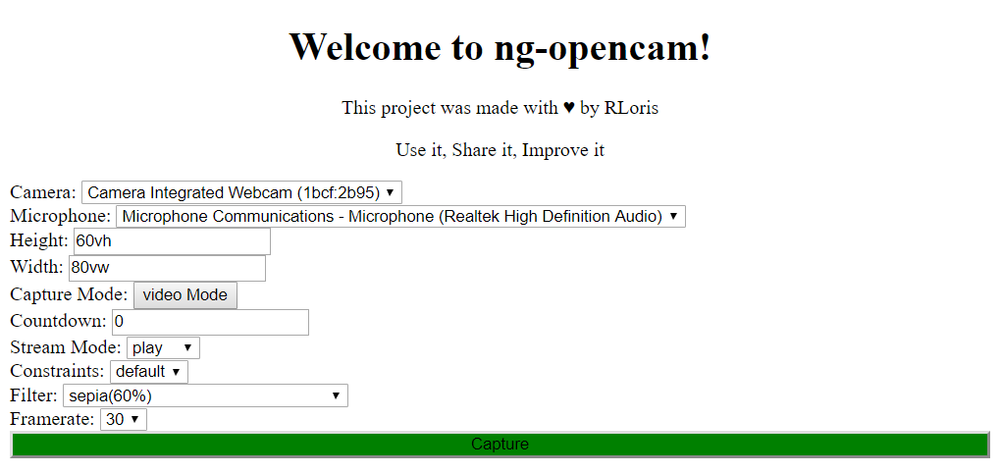

# Ng-Opencam

Opencam is an Angular library component developped to manipulate camera and perform various actions.
This project was generated with [Angular CLI](https://github.com/angular/angular-cli) version 7.3.1.

# NPM

You can integrate opencam in your project using `npm i ng-opencam --save`. For more documentation about opencam check out the readme in the projects/opencam folder or directly on the npm opencam page https://www.npmjs.com/package/ng-opencam.

# Demo OpenCam

Try it out here: [DEMO](https://rloris.github.io/lib-ng-opencam/)
### Configure it the way you want it

Clone this repo and run `ng serve` for a dev server. Navigate to `http://localhost:4200/`. The app will automatically reload if you change any of the source files. You can then test the opencam library demo.

# License

This project is under the MIT license.

# Author(s)

[RLoris](https://github.com/RLoris)
